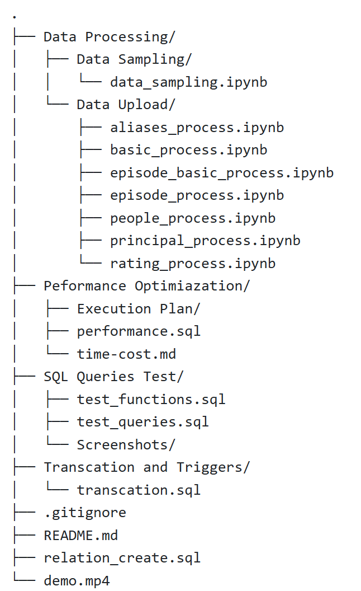

# CSE560-Project

---

## Overview

This project presents a powerful movie/TV database, including its structure, detailed contents, and a demonstration of its capabilities. The application aims to provide convenience for film production and facilitate information collection for industry professionals, film enthusiasts, data analysts, and industry observers.

---

## Directory Structure

> Data Processing

This folder contains scripts for data preprocessing and uploading.

> Data Processing/Data Sampling/data_sampling.ipynb

The size of the original IMDB datasets is too large for any free or low-cost database services. To create our dataset, we sampled 10% of the original data using this script.

> Data Upload

This folder contains scripts for preprocessing and uploading the dataset. The original .tsv datasets were preprocessed, including data cleaning and data transformation. Some .tsv files were divided or reorganized to match our database design. Then, the psycopg2 library was used to upload the processed data to the corresponding relations in PostgreSQL.
The file naming convention is: `<tsv_table_name>\_process.ipynb`

> Performance Optimization/performance.sql

This SQL file contains the logic for Task 7. It includes logic to generate detailed execution plan and indexing creation.

> Performance Optimization/Execution Plan

This directory saves the screenshots or txt files of 3 problemtic queries's detailed execution plan before and after indexing.

> SQL Queries
> This directory contains sql file and screenshots for Task 5.

> SQL Queries Test/test_functions.sql

This SQL file contains the SQL functions we implemnted for this database.

> SQL Queries Test/test_queries.sql

This SQL file contains the SQL queries we tested on this database.

> SQL Queries Test/Screenshots

This saves the screenshots of outputs of executing the test queries or functions

> Transcation and Triggers/transcation.sql

This contains logic for Task 6 which asks for a simple transcation with Failure Handling using a Trigger.

> relation_create.sql

The database is created using this file.

> README.md

A detailed description of the repository

> .gitignore
> Due to size limitation, original tsv and power BI files are ignored.

> demo.mp4
> The demonstration video of our database project.

---

## Power BI Visualization

https://app.powerbi.com/view?r=eyJrIjoiMTBkZjg1NmMtNDVhNy00YTFkLTk4NTctMzRmNTdhZWRhYmYzIiwidCI6Ijk2NDY0YThhLWY4ZWQtNDBiMS05OWUyLTVmNmI1MGEyMDI1MCIsImMiOjN9

---

## Source of Original Dataset

IMDb Non-Commercial Datasets
https://developer.imdb.com/non-commercial-datasets/
